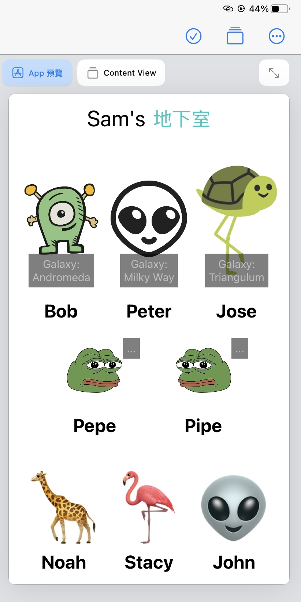

```swift

import SwiftUI

struct ContentView: View {
    var body: some View {
        VStack {
            TitleView()
            HStack{
                AlienView(imageName: "Bob",Galaxy: "Andromeda")
                AlienView(imageName: "Peter",Galaxy: "Milky Way")
                AlienView(imageName: "Jose",Galaxy: "Triangulum")
            }
            HStack{
                FrogView(imageName: "Pepe", Sentence: "...")
                FrogView(imageName: "Pipe", Sentence: "...")
            }
            HStack{
                EmojiView(emoji: "🦒", description: "Noah")
                EmojiView(emoji: "🦩", description: "Stacy")
                EmojiView(emoji: "👽", description: "John")
                
            }
        }
        .padding()
    }
}

struct AlienView: View{
    var imageName:String
    var Galaxy:String
    var body: some View{
        ZStack{
            VStack{
                Image(imageName)
                    .resizable()
                    .aspectRatio(contentMode:.fit)
                    .frame(height: 200, alignment: .center)
                Text(imageName.capitalized)
                    .fontWeight(.bold)
                    .font(.system(size: 25))
                
            }
            VStack{
                Text("Galaxy:")
                Text(Galaxy)
            }
            .font(.system(size: 15))
            .foregroundColor(.white)
            .padding(.all,5)
            .background(Color.black)
            .opacity(0.5)
            .offset(x: 0, y:50)}
        
        //        .frame(minWidth: 0, idealWidth: 100, maxWidth: .infinity, minHeight: 0, idealHeight: 100, maxHeight: .infinity, alignment: .center)
        
    }
}

struct FrogView: View{
    var imageName:String
    var Sentence:String
    var body: some View{
        ZStack{
            VStack{
                Image(imageName)
                    .resizable()
                    .aspectRatio(contentMode:.fit)
                    .frame(height: 100, alignment: .center)
                Text(imageName.capitalized)
                    .fontWeight(.bold)
                    .font(.system(size: 25))
                
            }
            Text(Sentence)
                .font(.system(size: 15))
                .foregroundColor(.white)
                .padding(.all,5)
                .background(Color.black)
                .opacity(0.5)
            .offset(x: 50, y:-50)}
    }
}

struct EmojiView: View{
    var emoji:String
    var description:String
    var body: some View{
        VStack{
            Text(emoji)
            .font(.system(size: 100))
            Text(description.capitalized)
                .fontWeight(.bold)
                .font(.system(size: 25))
        }
        }
    }
    
    struct TitleView: View{
        var body: some View{
            HStack(
                alignment:.center,spacing:10){
                    Text("Sam's")
                        .font(.system(size:30))
                    Text("地下室")
                        .font(.title)
                        .foregroundColor(.mint)
                }
            
        }
        
    }
    
    struct ContentView_Previews: PreviewProvider {
        static var previews: some View {
            ContentView()
        }
    }

```
